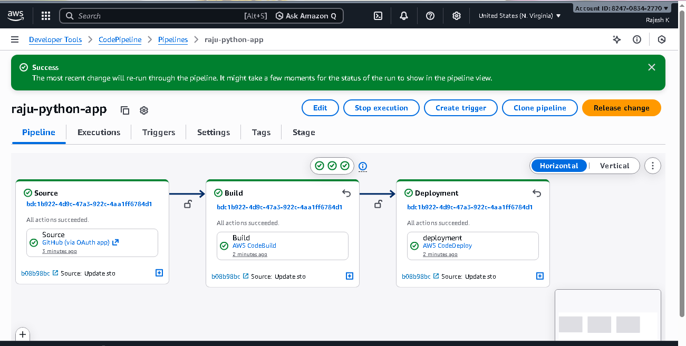

Here's a step-by-step process of the setup:

Introduction to CI/CD on AWS:

The video builds upon a previous session where the CI (Continuous Integration) part using AWS CodeBuild and CodePipeline was covered.
Today's focus is the CD (Continuous Delivery) part using AWS CodeDeploy to deploy a Python Flask application on an EC2 instance.
Creating an AWS CodeDeploy Application:

Navigate to the AWS CodeDeploy service in the AWS console.
Click "Create application" and provide a name (e.g., "sample-python-app").
Select the compute platform, which for this demonstration is EC2/On-premises.
Click "Create application". This registers your application with CodeDeploy.
Setting up an EC2 Instance for Deployment:

Launch a new EC2 instance.
Choose an Ubuntu AMI and a T2.micro instance type.
Select an existing key pair.
In network settings, ensure Auto-assign Public IP is enabled and use the default VPC.
Initially, SSH is enabled. Other ports like HTTP will be configured later if needed.
Crucially, add tags to the EC2 instance (e.g., Key: Name, Value: sample-python). These tags are essential for CodeDeploy to identify the target instances for deployment. Tags also help with cost optimization and resource tracking.
Launch the instance.
Installing the AWS CodeDeploy Agent on EC2:

SSH into the newly created EC2 instance.
Update packages: sudo apt update.
Install ruby-full: sudo apt install ruby-full -y.
Install wget: sudo apt install wget -y.
Download the CodeDeploy agent installer. This requires replacing the bucket name and region identifier with your specific region (e.g., us-east-1). The bucket name can be found in AWS CodeDeploy documentation.
Example command: wget [https://aws-codedeploy-us-east-1.s3.us-east-1.amazonaws.com/latest/install](https://aws-codedeploy-us-east-1.s3.us-east-1.amazonaws.com/latest/install`)
Make the installer executable: chmod +x ./install.
Run the installer: sudo ./install auto.
Check the agent status: sudo service codedeploy-agent status.
If the agent is not running, start it: sudo service codedeploy-agent start.
Configuring IAM Role for CodeDeploy and EC2:

Create a new IAM role.
For the trusted entity, select AWS service and choose CodeDeploy. This allows CodeDeploy to act on your behalf.
For permissions, attach the AWSCodeDeployRole managed policy (or a custom policy with equivalent permissions for CodeDeploy to access AWS services).
Name the role (e.g., "ec2-code-deploy-role") and create it.
Attach this IAM role to your EC2 instance:
Go to the EC2 instance.
Actions > Security > Modify IAM role.
Select the newly created "ec2-code-deploy-role".
Update the IAM role.
Important: After attaching the IAM role to the EC2 instance, restart the CodeDeploy agent on the EC2 instance: sudo service codedeploy-agent restart. Verify the status again.
Creating a CodeDeploy Deployment Group:

Go back to your CodeDeploy application.
Click on "Create deployment group".
Provide a deployment group name (e.g., "sample-python-app").
Select the service role created in the previous step.
For deployment type, choose In-place (for simple deployments without blue/green or Canary strategies, which require a load balancer and more complex setup).
Under "Environment configuration", select Amazon EC2 instances.
For the "Key" and "Value", use the tag you applied to your EC2 instance (e.g., Key: Name, Value: sample-python). CodeDeploy will identify the target EC2 instance(s) using these tags.
Skip "Load balancer" and "Advanced" settings for this basic setup.
Click "Create deployment group".
Understanding appspec.yaml and Deployment Files:

The appspec.yaml file defines the deployment lifecycle and specifies actions to be performed during different stages (hooks) of the deployment process.
This file must be located at the root of your GitHub repository if you are using GitHub as the source. If using S3, it can be in a subfolder.
The appspec.yaml typically includes:
version: The AppSpec file format version.
os: The operating system of the target instances (e.g., linux).
files: Specifies files to be copied to the instance.
hooks: Defines scripts to run at various stages (e.g., ApplicationStop, ApplicationStart, BeforeInstall, AfterInstall).
For this Python Flask application, two shell scripts are created:
stopcontainer.sh: (Placed in a scripts folder) Used to stop any running application containers.
startcontainer.sh: (Placed in a scripts folder) Used to pull the Docker image from Docker Hub and run it, exposing the application on a specified port (e.g., 5000, as defined in the Dockerfile).
These scripts are referenced within the appspec.yaml hooks.
Initiating a Deployment (and Troubleshooting):

Go to the CodeDeploy application and select the "Deployments" tab.
Click "Create deployment".
Select your deployment group.
Choose your GitHub repository as the revision type.
Connect to GitHub (if not already authenticated).
Provide your GitHub repository name (e.g., iam-veeramalla/aws-devops-zero-to-hero).
Enter the commit ID of the specific commit you want to deploy. This is important for testing individual CD functionality before integrating with CodePipeline.
Click "Create deployment".
Common Issues:
Deployment failure due to missing appspec.yaml: If appspec.yaml is not at the root of the GitHub repository, the deployment will fail. Ensure it's in the correct location.
Agent communication issues: Ensure the CodeDeploy agent is running and has the correct IAM permissions. Restarting the agent after IAM role changes is crucial.
The video shows a deployment failing initially because the appspec.yaml was not at the root. After correcting this (by creating and committing the appspec.yaml and the scripts folder with startcontainer.sh and stopcontainer.sh at the repository root), the deployment can be retried or a new one created.
This comprehensive setup allows CodeDeploy to fetch your application code, execute defined scripts, and deploy your application onto the specified EC2 instances.

