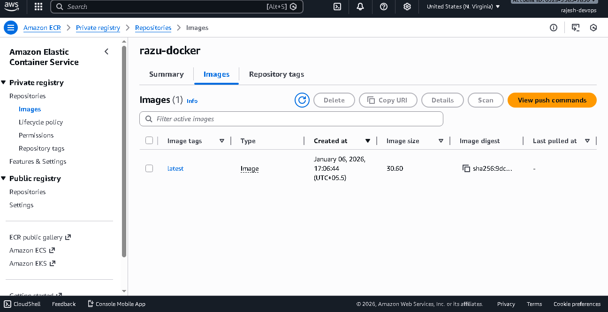

# Introduction to ECR: Explain what ECR is and its core purpose.

Breakdown of ECR (Elastic Container Registry): Explain what "Elastic," "Container," and "Registry" mean in this context.
ECR vs. Docker Hub: Detail the differences, pros, and cons of each, focusing on the video's emphasis on private repositories and AWS integration for ECR.
How to Use AWS ECR: Outline the practical steps for creating a repository, building, tagging, and pushing a Docker image to ECR, along with notes on AWS CLI and IAM permissions.
Conclusion: Briefly mention the importance of ECR in AWS workflows.
I will ensure to extract all the relevant details from the video and present them in a structured, README-like format. I will explicitly avoid timestamps as requested.Here's a README file based on the video's content about AWS ECR:

## AWS Elastic Container Registry (ECR)
This README provides an overview of AWS ECR, its comparison with Docker Hub, and the steps to use it for managing your Docker container images.

What is AWS ECR?
AWS ECR (Elastic Container Registry) is a fully managed AWS service designed to store and manage Docker container images. It functions as a container registry, similar to Docker Hub, allowing users to push and pull container images securely and efficiently.

The name "ECR" breaks down as:

Elastic: Signifies that the service is highly scalable and available, capable of accommodating any number of container images. AWS ensures the service's continuous availability.
Container: Refers to the containerized applications and their images (e.g., Docker images) that are stored.
Registry: Denotes its function as a central repository for storing and managing these container images.
ECR vs. Docker Hub
When choosing a container registry, it's important to understand the distinctions between ECR and other popular options like Docker Hub.

**Docker Hub:**

Often the first registry developers encounter due to its free public repositories.
Supports both public and private repositories. Public repositories allow anyone to view and download images. Private repositories restrict access to authorized users.
Requires separate account creation and management for users.
**AWS ECR:**

Fundamentally designed for private repositories by default, prioritizing security. While public repositories can be created, its core strength lies in private image management within the AWS ecosystem.
Seamlessly integrates with AWS Identity and Access Management (IAM). This means if your organization is already on AWS, you can leverage existing IAM users, roles, and policies to control access to ECR repositories, simplifying authorization and management.
Offers deep integration with other AWS services like Amazon ECS, Amazon EKS, and AWS Fargate, making it a preferred choice for applications deployed within the AWS cloud environment.
Includes features like image scanning to automatically detect vulnerabilities in pushed images, enhancing security.
It is not a free service; costs are incurred based on storage and data transfer. Users are advised to delete repositories after demonstrations to avoid charges.
Key takeaway for organizations:
For personal projects or public images, Docker Hub is often sufficient. However, for organizational use, especially if already using AWS, ECR provides a secure, integrated, and scalable solution for managing private container images, leveraging existing AWS infrastructure and security controls.

How to Use AWS ECR (Practical Steps)
To use AWS ECR, you'll generally follow these steps:

**Prerequisites:**

An active AWS account.
AWS Command Line Interface (CLI) installed and configured on your local machine. If not installed, refer to the AWS CLI documentation. Ensure your AWS CLI is configured with appropriate access keys and region. For IAM users, ensure they have the necessary ECR permissions (e.g., AmazonEC2ContainerRegistryFullAccess or more granular policies).
Docker installed on your local machine.
Create an ECR Repository:

Navigate to the ECR service in the AWS Management Console.
Click on "Get Started" or "Create repository."
Choose "Private" as the visibility setting (recommended for most use cases).
Provide a unique Repository name (e.g., demo-app-repo).
(Optional) Enable Tag immutability to prevent overwriting image tags.
(Optional) Enable Scan on push to automatically scan images for vulnerabilities when pushed.
Click "Create repository."
Retrieve Push Commands:

Once the repository is created, click on the repository name.
Click the "View push commands" button. This will provide a set of Docker and AWS CLI commands tailored for your repository.
Authenticate Docker to ECR:

Copy the first command provided (e.g., aws ecr get-login-password --region | docker login --username AWS --password-stdin .dkr.ecr..amazonaws.com).
Run this command in your terminal. This command uses AWS CLI to retrieve an authentication token and pipes it to the docker login command, securely logging your Docker client into your ECR registry.
Build Your Docker Image:

Navigate to the directory containing your Dockerfile.
Use the docker build command to build your image. The provided command will be similar to docker build -t ..
Example: docker build -t demo-app-repo .
Tag Your Docker Image:

Tag your locally built image with the ECR repository URI. The provided command will be similar to docker tag :latest .dkr.ecr..amazonaws.com/:latest.
Example: docker tag demo-app-repo:latest .dkr.ecr..amazonaws.com/demo-app-repo:latest
Push Your Docker Image to ECR:

Use the docker push command to upload your tagged image to ECR. The provided command will be similar to docker push .dkr.ecr..amazonaws.com/:latest.
Example: docker push .dkr.ecr..amazonaws.com/demo-app-repo:latest
Verify:

Refresh your ECR repository page in the AWS console. You should now see your pushed Docker image listed.
Conclusion
AWS ECR is an essential service for managing container images within the AWS ecosystem, offering robust security, scalability, and deep integration with other AWS services. It is the recommended choice for organizations looking to secure and streamline their container image workflows in the cloud.

