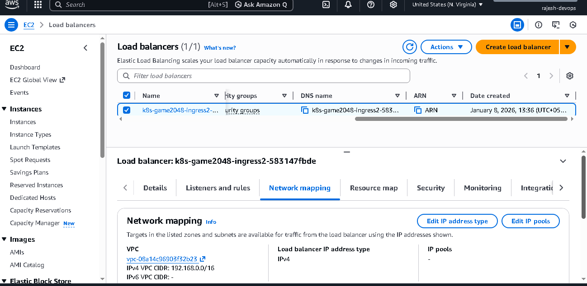
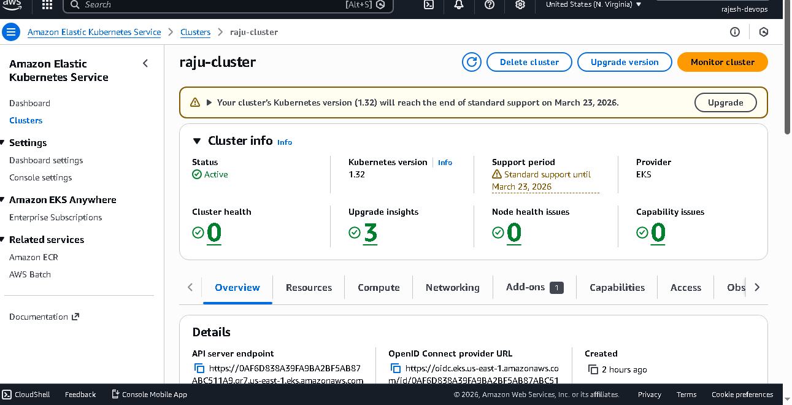

# Kubernetes End-to-End Project on EKS
This project demonstrates a complete end-to-end deployment of a real-time application (the 2048 game) on AWS Elastic Kubernetes Service (EKS). It covers the theoretical concepts of EKS, its benefits, and a step-by-step practical implementation including EKS cluster creation, application deployment, and exposing the application to the outside world using Ingress and ALB Ingress Controller.

**Table of Contents**
What is EKS?
Why EKS? Advantages of EKS
Kubernetes Cluster Components (Brief Overview)
Exposing Applications: Service and Ingress
Prerequisites for the Demo
**Demo Steps
Creating the EKS Cluster**
Configuring kubectl
Creating a Fargate Profile
Deploying the 2048 Game Application with Service and Ingress
1. What is EKS?
EKS (Elastic Kubernetes Service) is a managed Kubernetes offering by AWS. It simplifies the deployment, management, and scaling of Kubernetes clusters. Unlike self-managed Kubernetes where you handle all infrastructure, EKS manages the Kubernetes control plane components for you.

2. Why EKS? Advantages of EKS
When setting up a Kubernetes cluster, you typically have two main components:

Control Plane (Master Nodes): Manages the cluster, includes API server, etcd, scheduler, controller manager.
Data Plane (Worker Nodes): Where your applications (pods) run.
Challenges with self-managed Kubernetes:

Tedious Setup: Manually installing and configuring master and worker node components (e.g., using kubeadm).
Operational Overhead: Managing the control plane is complex. Issues like certificate expiry, API server slowness, etcd crashes, and scheduler failures require significant debugging and maintenance.
Scalability & High Availability: Ensuring a highly available master architecture (e.g., 3 masters) and scaling worker nodes requires manual configuration and monitoring (e.g., with auto-scaling groups).
## How EKS addresses these challenges:

**Managed Control Plane:** AWS takes care of all control plane components. This means AWS ensures high availability, manages upgrades, handles issues like certificate expiry, and maintains the health of components like the API server, etcd, and scheduler.
Simplified Worker Node Management: While EKS manages the control plane, you still manage worker nodes. EKS offers two main options for worker nodes:
**EC2 Instances:** You provision and manage EC2 instances as worker nodes. You would need to configure auto-scaling for high availability.
**Fargate:** This is an AWS serverless compute engine for containers. When used with EKS, Fargate completely removes the need to provision, scale, or manage worker nodes (EC2 instances). EKS manages the control plane, and Fargate manages the worker nodes, creating a truly serverless and highly available Kubernetes experience.
**Robust & Stable Clusters:** By offloading control plane management to AWS, you can build more robust and stable Kubernetes clusters with less operational burden.
Console Visibility: EKS provides a console for monitoring and managing your cluster resources (pods, services, deployments) without needing to solely rely on the command line.
**Drawbacks of EKS:**
While EKS offers significant advantages, it's important to be aware of potential drawbacks, which can include cost implications and certain limitations compared to highly customized on-premise solutions.

3. Kubernetes Cluster Components (Brief Overview)
A Kubernetes cluster consists of:

Master Nodes (Control Plane): Houses components like API server, etcd, scheduler, and controller manager. These are responsible for managing the cluster state and operations.
Worker Nodes (Data Plane): Where containers (pods) are actually deployed and run. They interact with the master nodes.
4. Exposing Applications: Service and Ingress
When you deploy an application as a Pod in Kubernetes, it initially only has a "cluster IP," meaning it's only accessible from within the cluster. To expose your application to the outside world, Kubernetes provides several mechanisms:

**Service:** A Kubernetes Service defines a logical set of Pods and a policy by which to access them. Services can expose your application in three main modes:

**ClusterIP:** Default mode, only accessible within the cluster.
NodePort: Exposes the application on a static port on each worker node's IP address. Accessible from anywhere that can reach the worker nodes (e.g., within the VPC). Not ideal for public access as it still requires direct access to node IPs.
**LoadBalancer:** Automatically provisions an AWS Load Balancer (ELB/ALB) to expose the application publicly. While simple, it can be costly if you have many applications, as each service type LoadBalancer creates a dedicated load balancer.
**Ingress:** Ingress is an API object that manages external access to the services in a cluster, typically HTTP. Ingress acts as a smart router that routes external traffic to appropriate services within the cluster based on rules (e.g., hostname or path).

**Ingress Resource:** You define rules in an ingress.yaml file, specifying how external traffic should be routed to your services. For example, example.com/abc might route to service-A and example.com/xyz to service-B.
**Ingress Controller:** An Ingress resource alone doesn't do anything. You need an Ingress Controller running within your cluster. The Ingress Controller watches for Ingress resources and configures a load balancer (or other traffic routing mechanism) accordingly. Popular Ingress Controllers include:
**nginx Ingress Controller: **Configures an Nginx load balancer.
AWS ALB Ingress Controller: Specifically integrates with AWS Application Load Balancers (ALB). This controller watches Ingress resources and automatically provisions and configures ALBs based on the rules defined. This is a cost-effective way to expose multiple applications through a single ALB.
**Flow with Ingress:**
User -> Public Load Balancer (configured by Ingress Controller) -> Ingress Resource Rules -> Service -> Pod

5. Prerequisites for the Demo
Before starting the practical demo, ensure you have the following tools installed and configured on your local machine:

kubectl (Kubernetes Command Line Tool): Used to interact with Kubernetes clusters.
Installation instructions can be found on the official Kubernetes documentation.
eksctl: A command-line tool for Amazon EKS that simplifies cluster creation and management.
Installation instructions are available on the eksctl GitHub page.
AWS CLI (Command Line Interface): Used to interact with AWS services.
Installation and configuration (using aws configure with Access Key ID and Secret Access Key) instructions are available on the official AWS documentation.
Note: For demonstration purposes, the root AWS account is used to avoid permission complexities. In a production environment, use IAM roles with appropriate permissions.

6. Demo Steps
This section outlines the steps to deploy the 2048 game application on an EKS cluster. The YAML files and commands used in this demo are available in the associated GitHub repository.

Creating the EKS Cluster
The EKS cluster will be created using eksctl, opting for Fargate for serverless worker node management.

bash
eksctl create cluster --name demo-cluster-one --region us-east-1 --fargate

This command will:

Provision a highly available EKS control plane.
Create a VPC with public and private subnets.
Configure the cluster to use Fargate for worker nodes, meaning you won't manage EC2 instances directly.
This process can take 10-20 minutes.
Configuring kubectl
After the cluster is created, you need to update your kubeconfig file so kubectl can connect to your new EKS cluster.

bash
aws eks update-kubeconfig --name demo-cluster-one --region us-east-1

You can then verify the connection by checking resources in the console or using kubectl get pods -n kube-system.
**
Creating a Fargate Profile**
Since we are using Fargate, and to deploy applications into specific namespaces, we need to create a Fargate profile for that namespace. By default, Fargate profiles exist for default and kube-system namespaces.

bash
eksctl create fargateprofile --cluster demo-cluster-one --region us-east-1 --name alb-sample-app --namespace game2048

This command creates a Fargate profile named alb-sample-app for the game2048 namespace, allowing pods in this namespace to be scheduled on Fargate.

Deploying the 2048 Game Application with Service and Ingress
The application deployment includes creating a Kubernetes Namespace, Deployment, Service, and Ingress resource. All these configurations are typically combined into a single YAML file for simplicity.

The 2048-app-deploy-ingress.yaml file performs the following:

Namespace Creation: Creates a game2048 namespace.
Deployment: Defines the 2048 game application with a specified container image and replica count (e.g., 5 replicas).
Service: Creates a ClusterIP Service to expose the pods internally. It uses labels and selectors to discover the pods.
Ingress: Defines how external traffic will reach the application.
It uses annotations to specify the kubernetes.io/ingress.class: alb, indicating that the AWS ALB Ingress Controller should manage this Ingress.
It sets up routing rules to forward requests to the 2048-game service.
To deploy the application, run:

bash
kubectl apply -f https://raw.githubusercontent.com/iam-veeramalla/aws-devops-zero-to-hero/main/day-22/2048-app-deploy-ingress.md

The AWS ALB Ingress Controller (which needs to be deployed separately and configured in your cluster, although this video uses the default setup with eksctl implicitly enabling its function with Fargate and Ingress class) will watch for this Ingress resource. Upon detecting it, the controller will automatically provision an AWS Application Load Balancer (ALB) and configure it to route external traffic to your 2048 game application running on EKS.

